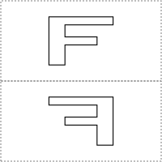

# Escher-in-Elm Workshop

Welcome to the Escher-in-Elm Workshop!

This workshop is based on the classic 1982 paper "Functional Geometry" by Peter Henderson. The paper shows the functional decomposition and reconstruction of Escher's woodcutting "Square Limit", a beautiful recursive tesselation of interleaving fish. In this workshop, we will follow in Henderson's footsteps as we create an SVG replica of it.

This workshop uses Elm as the implementation language, but it is not an Elm tutorial. If you feel need a proper Elm tutorial before attempting this workshop, take a look at [Awesome Elm](https://github.com/isRuslan/awesome-elm) to find one that suits you.

If all you need is a syntax cheat-sheet, you can take a look here.

The focus in this workshop is on abstraction and composition. It happens to use Elm because we will be producing an SVG, and the browser is a nice runtime for that.

## Getting started

You should start by cloning this repo, like so: 

```
git clone https://github.com/einarwh/escher-workshop
````

You should see that we're not starting from scratch. You get a number of `.elm` files containing Elm modules. Most of them we can and will ignore in this workshop. 

You can start the application by typing `elm-reactor` in your terminal. If you open a browser at `http://localhost:8000/Main.elm` you should see something that looks like this:


Which is an SVG rendering of the letter F.

If you open `Main.elm` in your editor, you'll see that we import a bunch of stuff. 

Try to change this line:

```
box |> createPicture fLetter
```

To this: 

```
box |> createPicture george
```

You should see something like this: 


We replaced the letter F with a stickman called George.

At this point, you probably have questions! Here are some answers, that may or may not fit those questions. First, `letterF` and `george` are shapes, mere data defined in `Letter.elm` and `Figure.elm` respectively. More interestingly, `createPicture` is a function that creates a picture out of a shape. And most interestingly, a picture is also a function (!) - from a bounding box to an SVG rendering. This makes a picture somewhat magical, in that it can produce a bunch of different renderings, based on the box you give it.

Try to mess with the bounding box passed to George and see what happens. He has no choice but to stretch and contract to fit the box! 

Let's return to the rendering of the letter F, and try to understand what happens a little bit better. 


If you open `Box.elm`, you'll see that a box is defined by three vectors: `a`, `b` and `c`. 

## Exercises

We will start by defining a number of simple picture transformations; functions of type Picture -> Picture.

### Exercise 1 : turn

Define a function _turn_, which rotates a picture 90 degrees counter-clockwise around the center of its bounding box.


The key to success is to exploit the magical self-fitting nature of the rendering. We know that when the box changes, the rendering changes also. So to turn the picture, all we need to do is turn the box - the picture has no choice but to follow along!

```
(a’, b’, c’) = (a + b, c, -b)
```

You should observe that turning a picture twice rotates it 180 degrees, and turning it four times produces the original picture.

### Exercise 2 : flip

Define a function _flip_, which flips a picture about the center vertical axis of its bounding box.


```
(a’, b’, c’) = (a + b, -b, c)
```

Note that flipping a picture twice (indeed any even number of times) produces the original picture.

### Exercise 3 : toss

Define a function _toss_, which resembles tossing a picture light-heartedly into the air! More precisely, it should rotate the picture 45 degrees around top left corner of the bounding box, and also shrink the sides of the bounding box by a factor of √2.


```
(a’, b’, c’) = (a + (b + c) / 2, (b + c) / 2, (c − b) / 2)
```

### Exercise 4 : above

Now we'll start combining pictures to create more complex, composite pictures.

Define a function _above_, which takes two pictures _p1_ and _p2_ as parameters. It should produce a new picture which fills the upper half of the bounding box with _p1_ and the lower half with _p2_.

So calling `above f (flip f)` should yield the following:



Define a more general function _aboveRatio_ that takes integers _n_ and _m_ as parameters, as well as _p1_ and _p2_ as above. The integers _n_ and _m_ are weights allocated to _p1_ and _p2_ respectively. 

Calling `aboveRatio 3 1 f (flip f)` should be interpreted as _allocate 3/4 of the original bounding box to the top picture and 1/4 to the bottom picture_, yielding the following:


Now implement _above_ in terms of _aboveRatio_.

### Exercise 5 : beside

Define a function _besideRatio_, which is similar to _aboveRatio_. However, rather than placing _p1_ on top of _p2_, it should place _p1_ to the left of _p2_. 

Define _beside_ in terms of _besideRatio_.

### Exercise 6 : quartet

Using _above_ and _beside_, define a function _quartet_ which takes four pictures _nw_, _ne_, _sw_ and _se_ as inputs and organizes them in a 2x2 grid. The names of the pictures hint at where in the grid they should be put.

One of the most interesting and powerful properties of the combinators in Henderson's paper is that they are _closed under the means of combination_. That means that there is no difference between a "simple" picture (like F and George) and a "composite" picture. They're all just pictures. There are no arbitrary restrictions on what you can do with them. You're free to use a composite picture as a building block to create a more complex composite picture. To get a feel for this, try to create this picture, using the combinators we have defined so far:

### Exercise 7 : nonet

Define a function _nonet_ which is like _quartet_, except it creates a picture by organizing nine input pictures in a 3x3 grid. The _aboveRatio_ and _besideRatio_ functions should be helpful to accomplish this.

Try to create the following image:

Again, a nonet is just a picture, which can be used to create more complex pictures (including nonets). See if you can create the following picture:

### Exercise 8 : over

### Exercise 9 : t-tile

### Exercise 10 : u-tile

### Exercise 11 : side

### Exercise 12 : corner

### Exercise 13 : square-limit

