# The Escher School of Fish Workshop

Welcome to The Escher School of Fish Workshop!

This workshop is based on [the revised 2002 edition](https://eprints.soton.ac.uk/257577/1/funcgeo2.pdf) of the classic 1982 paper "Functional Geometry" by Peter Henderson. The paper shows the functional decomposition and reconstruction of Escher's woodcutting "Square Limit", a beautiful recursive tesselation of interleaving fish. 

The focus in this workshop is on abstraction and composition using functions. It uses Elm as the implementation language, but it is _not_ an Elm tutorial. If you came here looking for a proper Elm tutorial, or feel you need such a tutorial before attempting this workshop, take a look at [Awesome Elm](https://github.com/isRuslan/awesome-elm) to find one that suits you. (If all you need is a syntax cheat-sheet to consult, you can take a look [here](Sheet.elm)).

This workshop is essentially a guided tour to Henderson's paper. You will implement a collection of simple yet powerful picture combinators that will ultimately enable you to recreate Henderson's replica of "Square Limit". You will do so in Elm because the replica will be an SVG, and the browser is a nice runtime for that.

## Getting started

You should start by cloning this repo, like so: 

```
git clone https://github.com/einarwh/escher-workshop
````

You're not starting from scratch, the repo contains a number of `.elm` files containing Elm modules. Most of them you can safely ignore in this workshop. But some of them you'll become familiar with. 

First though, you can start the application by typing `elm reactor` in your terminal. If you open a browser at `http://localhost:8000/src/Main.elm` you should see something that looks like this:

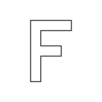

Which is an SVG rendering of the letter F.

Open `Main.elm` in an editor and try to change this line:

```
box |> createPicture fLetter
```

To this: 

```
box |> createPicture george
```

You should see something like this: 

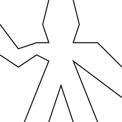

The letter F has been replaced with a stickman called George, stolen from the [SICP lecture](https://ocw.mit.edu/courses/electrical-engineering-and-computer-science/6-001-structure-and-interpretation-of-computer-programs-spring-2005/video-lectures/3a-henderson-escher-example/) on Henderson's paper.

At this point, you probably have questions! Here are some answers, that may or may not fit those questions. First, `letterF` and `george` are shapes, mere data. More interestingly, `createPicture` is a function that creates a picture out of a shape. And most interestingly, a picture is also a function (!) - from a bounding box to an SVG rendering. This makes a picture somewhat magical, in that it can produce a bunch of different renderings, based on the box you give it.

Initially, the box looks like this: 
```
box = { a = { x = 125.0, y = 75.0 }
      , b = { x = 250.0, y = 0.0 }
      , c = { x = 0.0, y = 250.0 } }
```
Which outlines a nice square box for George to live in. 

Try to change some of the numbers. Mess around with the bounding box passed to George and see what happens. He has no choice but to stretch and contract to fit the box! Poor ol' George! Here he is all thin and skewed and weird: 

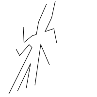

Let's return to the rendering of the letter F, and try to understand what happens a little bit better. Adding some visual aids for the bounding box should help.

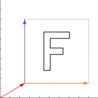

Open `Box.elm` to see that a box is defined by three vectors: `a`, `b` and `c`. The red arrow is the `a` vector, which points from the origin (0, 0) to the bottom left corner of the box. The orange arrow is the `b` vector, which points from the bottom left corner to the bottom right corner, and spans out the box horizontally. The purple arrow is the `c` vector and points from the bottom left corner to the top left corner, and spans it out vertically. (What about the top right corner? It is implicitly defined by vectors `b` and `c` - you can get there from the bottom left corner if you follow `b` and then `c` or vice versa.)

Speaking of vectors: you might want to take a look at `Vector.elm` as well. The vectors have two dimensions, `x` and `y`. You can add vectors together (by adding up the `x` and `y` dimensions separately), negate a vector (effectively have it pointing the other way) and subtract a vector from another. You can also scale a vector by some factor; a factor of 2 doubles it, a factor of 0.5 makes it half as long. And finally you can calculate the vector's length or magnitude. 

And that's about it for theory. Do you feel ready? You are ready. It's time to start doing some exercises!

## Exercises

You will start by defining a number of simple picture transformations; functions of type `Picture -> Picture`.

### Exercise 1 : turn

Your first task is to define a function `turn`, which rotates a picture 90 degrees counter-clockwise around the center of its bounding box. 

Applied to the letter F, it should produce this:

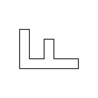

Open the file `Picture.elm`. You'll see that the type signature for the `turn` function has already been written, along with a dummy implementation that does nothing - it just returns the picture you pass it. 

```
turn : Picture -> Picture
turn p = p 
```

The key to solving this task is to exploit the magical self-fitting nature of the picture. We know that when the box changes, the rendering changes also. So to turn the picture, all you need to do is turn the box - the picture has no choice but to follow along! It's poor ol' George all over again. So you should open `Box.elm` and define a function `turnBox` there that handles the box-turning, and then have your `turn` function call `turnBox`.

But how do you turn the box? Well, first off, you don't really turn the box. That is, you don't mutate the box you're given. You create _another_ box that is turned when compared to the original. You'll want the `a` vector of the new box to point to the bottom right corner of the original box. (You can create that vector by adding the original `a` vector and the original `b` vector together.) The `b` vector needs to point straight up, just like the original `c` vector. And finally, the `c` vector should point to the left, in the exact opposite direction as the original `b` vector. 

That's a lot of words for something quite simple. Summarized in terms of vector arithmetic, we have this:
```
(a’, b’, c’) = (a + b, c, -b)
```

(Of course, you'll need to substitute the vector addition 
function `add` for `+` and so forth in your Elm code.)

And finally, with vector arrows and an outlined bounding box, it looks like this: 

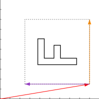

Have you implemented `turn`? Make sure you remember to call it in `Main.elm`!

If you find yourself struggling, don't worry! There are quite a few concepts to take in, so that's to be expected. If you're completely stuck, you can jump to the `exercise-1` branch of the repo (`git checkout exercise-1`) to take a look at how I implemented the exercise. Once you've seen the solution to one exercise, you might find the next exercises more approachable. (And of course there are similarly named branches showing solutions to all the exercises in the workshop.)

When you have a working implementation of `turn`, you should observe that turning a picture twice rotates it 180 degrees, and turning it four times produces the original picture. And by _observe_ I mean _try it out to verify it_.

(_Entirely optional advanced bonus exercise not needed to progress in this workshop_: If you are very comfortable with recursion and composition, create a helper function `times` with the type signature
`Int -> (a -> a) -> (a -> a)`. The function takes a number and a function as parameters, and composes that function _with itself_ the number of times you specify. For instance, if you have a function `double x = x + x`, calling `(times 2 double) 3` would be tantamount to calling `(double >> double) 3`, both yielding 12 as result. Calling `(times 0 double) 3` should apply the double function 0 times, yielding 3. Use `times` to define a function `turns` that turns a picture the specified number of times.)

### Exercise 2 : flip

Define a function `flip`, which flips a picture about the center vertical axis of its bounding box. 

Applied to the letter F, it should produce this:

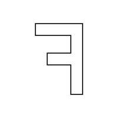

The solution is once again to transform the box before passing it to the picture to produce a rendering. 

Here's how the flipped F looks with box and arrows:

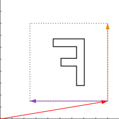

You should be able to work out the vector arithmetic on your own.

Note that flipping a picture twice (indeed any even number of times) produces the original picture. 

Try experimenting with combinations of flips and turns. 

Also, since both `flip` and `turn` are functions of type `Picture -> Picture`, you can freely compose them into new functions of the same type, such as `ttf = turn >> turn >> flip`.

### Exercise 3 : toss

Define a function `toss`, which resembles tossing a picture light-heartedly into the air! More precisely, it should rotate the picture 45 degrees around top left corner of the bounding box, and also shrink the sides of the bounding box by a factor of √2. 

Here's a visualization which includes both the original and the transformed bounding box:

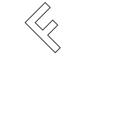

You don't have to work out the vector arithmetic yourself this time:

```
(a’, b’, c’) = (a + (b + c) / 2, (b + c) / 2, (c − b) / 2)
```

(Tip: recall that dividing by two is the same as multiplying by half, and that `scale` does scalar multiplication of vectors.)

Whee! High up in the air!

### Exercise 4 : above

Now we'll start combining pictures to create more complex, composite pictures.

Define a function `above`, which takes two pictures `p1` and `p2` as parameters. It should produce a new picture which fills the upper half of the bounding box with `p1` and the lower half with `p2`.

Calling `above f (flip f)` should yield the following (with bounding boxes outlined for clarity):

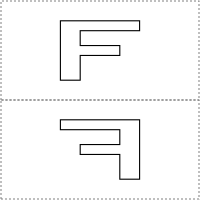

This exercise requires quite a bit more work than the previous exercises, and really tests your understanding of the abstractions you're working with. (If you feel overwhelmed, frustrated or lost when attempting to solve this exercise, consider jumping ahead to the `exercise-4` branch which contains a solution. The rest of the workshop does not rely on a thorough understanding of the implementation of `above`. Make sure you get acquainted with the results of calling `above` and `aboveRatio` with various inputs though - that will be useful.)

Recall that a `Picture` is nothing more and nothing less than a function from a `Box` to a `Rendering`, and that a `Rendering` is a list of stuff. This should give you a clue as to how you can create a single, composite rendering out of two simpler renderings, and ultimately a function that produces that composite rendering when given a bounding box. In your implementation you will need to take the box you are given, and somehow use that to create two new boxes. One of those boxes will need to be moved a bit (essentially: given a new `a` vector), and both will need to be scaled (shrunk vertically). In sum, they should cover the same area as the original box. If you pass one of these boxes to each of the pictures passed to `above`, you will have two renderings. Now the question is: how do you combine those into a single rendering? Well, they're just lists of stuff - and you do know how to combine lists, right? ([No?](Sheet.elm#L39))

Define a more general function `aboveRatio` that takes integers `m` and `n` as parameters, as well as `p1` and `p2` as above. The integers `m` and `n` are weights allocated to `p1` and `p2` respectively. So `p1` should be given a box that is `m / m + n` as tall as the original box, whereas the rest (`n / m + n`) is given to `p2`. 

Calling `aboveRatio 3 1 f (flip f)` should be interpreted as _allocate 3/4 of the original bounding box to the top picture and 1/4 to the bottom picture_, yielding the following:

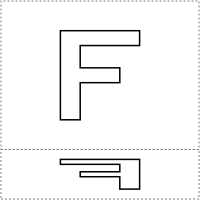

Now implement `above` in terms of `aboveRatio`. It should be a one-liner.

### Exercise 5 : beside

Define a function `besideRatio`, which is similar to `aboveRatio`. However, rather than placing `p1` on top of `p2`, it should place `p1` to the left of `p2`. 

Calling `besideRatio 3 5 f (flip f)` should be interpreted as _allocate 3/8 of the original bounding box to the left picture and 5/8 to the right picture_, yielding the following:

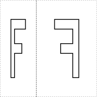

Define `beside` in terms of `besideRatio`.

What happens if you render `beside f (beside (turn f) (turn (turn f)))`? How would you go about allocating an equal amount of space for three pictures? 

Can you turn the composite picture you just made? 

(_Optional bonus exercise_: Speaking of turning: you probably implemented `besideRatio` by manipulating boxes, just like you did for `aboveRatio` in Exercise 4 - right? Try to implement it by calling `aboveRatio` and `turn` instead.)

### Exercise 6 : quartet

You might feel at this point that you're progressing slowly, and that "Square Limit" must be miles off. Unless you've cheated, you still haven't seen a single fish. Despair not! You have come further along than you might think. Indeed, you are already ready to leave the low-level world of vectors completely behind! From now on, you'll concentrate on using the simple picture combinators you've written to create more powerful ones. 

Using `above` and `beside`, define a function `quartet` which takes four pictures `nw`, `ne`, `sw`and `se` as inputs and organizes them in a 2x2 grid. The names of the pictures hint at where in the grid each picture should be put. I hope you will be pleasantly surprised by how easy it is.

See if you can recreate this picture, by passing appropriately transformed Georges to `quartet`:

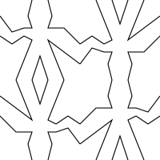

One of the most interesting and powerful properties of the combinators in Henderson's paper is that they are _closed under the means of combination_. That means that there is no difference between a "simple" picture (like F and George) and a "composite" picture like the one you just created. They're all just pictures! There are no arbitrary restrictions on what you can do with them. You're free to use a composite picture as a building block to create a more complex composite picture. To get a feel for this, try to create this picture, using the combinators defined so far:

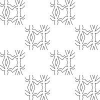

(You might find the picture `blank` - which renders _nothing_ when given a bounding box - useful when creating the pattern.)

### Exercise 7 : nonet

Define a function `nonet` which is like `quartet`, except it creates a picture by organizing nine input pictures in a 3x3 grid. The `aboveRatio` and `besideRatio` functions should be helpful to accomplish this.

Test your function by creating the following image:

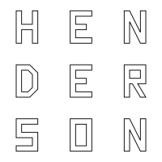

You'll find the letters you need defined in `Letter.elm`. You turn the letters into pictures by passing them to `createPicture`.

Again, a nonet is just a picture, which can be used to create more complex pictures (including nonets). See if you can create the following picture:

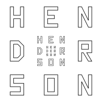

Abstractions that compose are a wonderful thing.

### Pause for fish

At this point, let's introduce Escher's fish! (My version of Henderson's version of it, anyway.) The shape of the fish is defined in `Fishy.elm`. You can turn the shape into a proper fish picture by calling `createPicture fishShapes`.

If you pass it a suitable bounding box, the fish should render like this:


You might find it weird that parts of the fish are rendered _outside_ the bounding box - I mean, is that even legal? It's not really bounded at all! But yes, it is quite legal. The picture will render its shape adjusted and fitted to the box you give it, but not necessarily _inside_ it. 

Apart from that, the fish looks rather ordinary at first glance. But it does have some interesting properties that will become apparent during the next few exercises.

### Exercise 8 : over

Define a function `over` that combines two pictures in such a way that it will render the two pictures on top of each other, in the same box. 

If you call `over fish fish`, the result will be very boring: it will just show the fish. Right? Because the two fishes are rendered exactly on top of each other.  

But if you call `over fish (turn (turn fish))`, the result is much more interesting. 

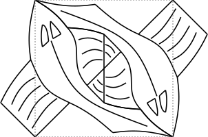

It might be helpful to think of `over` as a primitive version of `above` when solving this exercise.

(_Optional bonus exercise_: If you like, you can generalize `over` to take a list of pictures and render all of them on top of each other.)

### Exercise 9 : t-tile

The next exercise is a little more difficult, I'm afraid, but it also yields a more interesting picture! That picture is what Henderson calls the _t-tile_, and is a key ingredient when composing "Square Limit". 

Using `toss`, `flip`, `turn` and `over`, define a function `ttile` that takes a single picture as a parameter (it's going to be the fish). It should overlay three variations of that fish on top of each other, yielding the following picture: 

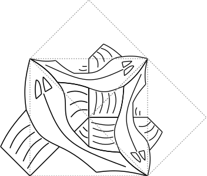

(The big fish is easy, right? It's just the fish as-is! And the fish on top, with the bounding box that resembles the flap of an envelope, should make you think of tossing things into the air. And the final fish is very much similar to the fish on top.)

Presumably at this point, you can imagine Escher spending some time coming up with the design for this fish.

### Exercise 10 : u-tile

Next up is the _u-tile_. It should offer no major challenges now that you've already managed the _t-tile_.

The function `utile` should accept a single picture as parameter (the fish again), and once more, you should use the functions `toss`, `flip`, `turn` and `over` to create the picture. 

Calling `utile fish` should produce this picture: 

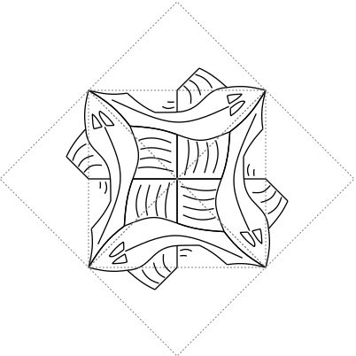

You'll need to overlay four fish on top of each other, but you'll notice that two of them are exactly the same as in the _t-tile_.

### Exercise 11 : side

Now you're really getting somewhere! Just two more exercises, and then you'll tackle the "Square Limit" itself!

I won't lie though - those two exercises are probably the most difficult ones in this workshop. They both require you to create _recursive_ picture functions.

The one you'll tackle first is `side`, a function that takes an integer `n` and a picture `p` (the fish) as parameters to produce a recursive picture. The integer designates the depth of recursion. 

For the degenerate case where `n = 0` and the recursion stops, `side` is terribly boring. It's just the `blank` picture that renders _nothing_.

The first level of recursion, where `n = 1`, is more interesting, and sheds more light onto the nature of `side`. It should look like this:

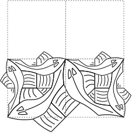

It's not so complex. It is a `quartet` where the pictures to the "north-west" (top left) and "north-east" are blank, whereas the "south-west" and "south-east" are t-tiles in different states of turning. The blank pictures in the "north" are more interesting than you might think: they should be produced by calling `side` recursively with `n` decremented from 1 to 0. The reason you're looking at blanks is that `side 0` produces blanks. 

For `n = 2`, you'd have instances of `side 1` where you previously had blanks. This yields the following picture: 

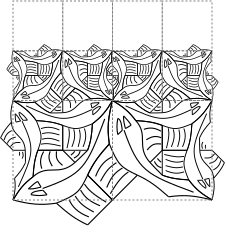

And so on and so forth.

### Exercise 12 : corner

Next, you should write the second recursive function, called `corner`. Just like `side`, it takes an integer `n` and a picture `p` (the fish) as parameters to produce a recursive picture. 

The degenerate case of `n = 0` is exactly as boring as before: the `blank` picture.

For `n = 1`, `corner` is just slightly more interesting:

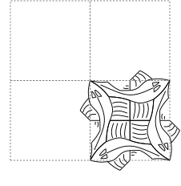

It's another `quartet`, and a very simple one. The "south-east" picture is a _u-tile_, the others are blank. But of course, this anticipates a little more effort in the recursive case, because we've seen before that recursion happens in the blanks. 

Let's take a look at what `corner` should produce for `n = 2`:

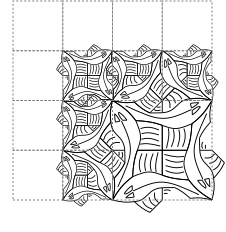

You can see that there are actually two distinct instances of recursion. The "north-west" picture should contain `corner 1`. But what about the "north-east" and "south-west" pictures? Do you recognize `side 1`?

### Exercise 13 : square-limit

You've made it all the way to the end! Congratulations! The last exercise is actually very simple. All the hard work is done.

Write a function `squareLimit` that takes an integer `n` (the depth of recursion) and a picture (the fish) and produces a `nonet` consisting of four corners, four sides, and a single _u-tile_ in the middle. (You'll need to turn those corners and sides as appropriate, of course.)

For `n = 3`, `squareLimit` should look like this:


I'd like to stress that the main lesson of this workshop is that `squareLimit` is still just a picture. There is no reason it can't be turned, flipped, tossed or combined into even more complex pictures! 

And just for fun, you might want to explore what happens if you pass something else than the fish to `squareLimit`, like George or the letter H - or how about `squareLimit` itself? (Beware that at some point your browser will succumb under the weight of an SVG that is very large indeed.)


